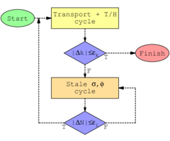
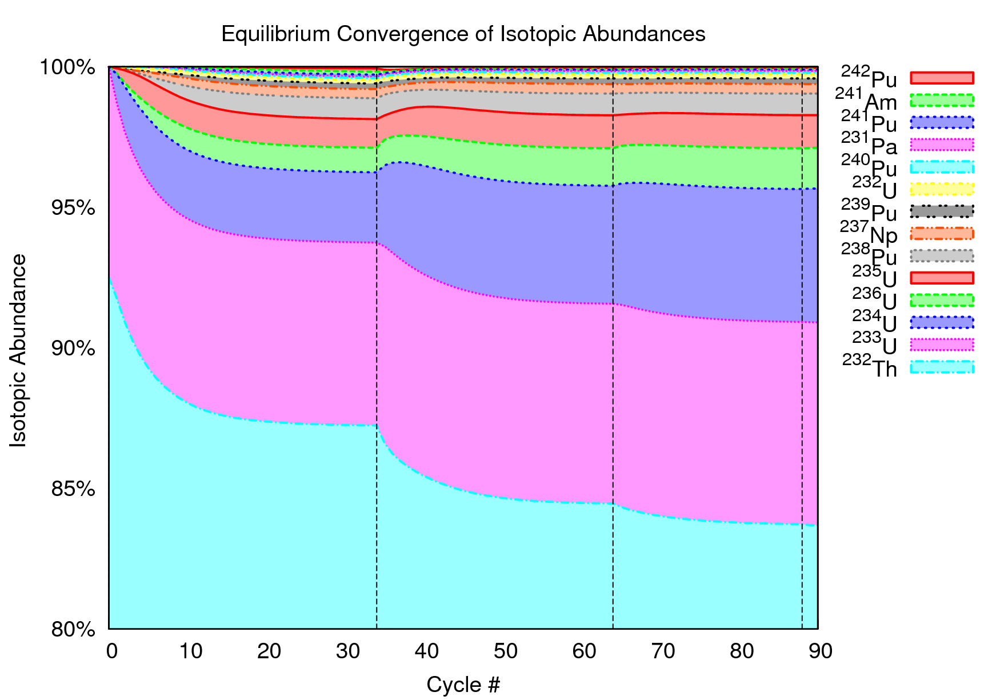

Overview of MocDown
===================

.. image:: ../img/assembly.png
   :height: 200px
   :alt: The RBWR-Th multi-assembly unit cell has been simulated with MocDown.

.. image:: ../img/thCoupling.png
   :height: 200px
   :alt: MocDown's online thermo-fluids coupling accommodates the strong physical coupling between neutron and thermal fields in the RBWR-Th core.

MocDown is a nuclear reactor core simulator.  It performs Monte Carlo depletion, using `MCNP6.1`_ for neutron transport and `ORIGEN2.2`_ for transmutation, just like the  `MONTEBURNS`_, `MOCUP`_, and `VESTA`_ codes.

MocDown is written in object-oriented `Python3`_.  It employs an accelerated equilibrium core composition search algorithm--ideal for systems with multi-recycling fuel cycles--and allows for loose, online coupling of thermo-fluids models.  Additionally, MocDown takes a simple approach towards neutron source rate scaling, which accounts for isotopic composition-dependent decay heat.

Access
------

The MocDown official repository can be found at `github`_.  Its source code can be downloaded as a `tarball`_ or `zipfile`_ or it can be cloned with git via::

  git clone git://github.com/jeffseif/MocDown.git ;

MocDown has the following dependencies:

- Python 3
- numpy
- ORIGEN2.2
- MCNP5, MCNPX, or MCNP6

Documentation
-------------

The following resources may be useful for users and developers.

.. toctree::
   :maxdepth: 1

   man
   src
   lib

How to cite
-----------

The best citation for MocDown from the :download:`proceedings <../lit/seifried2013aec.pdf>` of the `2013 SNA&MC`_ conference::

   J. E. Seifried, P. M. Gorman, J. L. Vujic, and E. Greenspan. Accelerated Equilibrium Core Composition Search Using a New MCNP-Based Simulator. Proceedings of the SNA&MC 2013 conference, Paris, France, October, 2013.

Future work
-----------

MocDown can always be improved!  The following is a (not exhaustive) to-do list for code development.

- Add unit tests
- Finalize implementation of ParseMcnp.py
- Implement ORIGEN with Python (PORIGEN)

  - Faster runtime
  - No I/O
  - No significant figure loss of precision
  - One set of isotopes
  - Calculate dose, radiotoxicity, and spontaneous neutron generation rates

- Improve RBWR-Th thermo-fluids models

  - Add conservation of momentum
  - Attach fine dP traverse
  - Improve sub-cooling
  - Couple to PATHS?

- Implement fuel temperature coupling

  - Requires ACE data at many temperatures
  - Code the MOX thermal conductivity correlation from MIT

- Generaliz fuel shuffling
- Refactor and generalize MCNP input updates

  - Cell density
  - Cell temperature
  - Material composition

- Add more post-processing tools

  - Reactivity swing
  - Recycling output file
  - Other performance metrics

- Add a switch to perform transport even when it is not needed
- Implement modified Euler predictor/corrector method of `Kotlyar, p. 9 <http://virtual.vtt.fi/virtual/montecarlo/mtg/2012_Madrid/Dan_Kotlyar.pdf>`_

Acknowledgements
================

MocDown was developed using funding received from the U.S. Department of Energy Office of Nuclear Energy's Nuclear Energy Univeersity Programs, U.S. Department of Energy National Nuclear Security Administration under Award Number DE-NA0000979, at the University of California, Berkeley.

.. image:: ../img/nsscLogo.jpg
   :height: 60px
   :alt: NSSC.

.. image:: ../img/ucbSeal.png
   :height: 60px
   :alt: UCB.

Indices and tables
==================

* :ref:`genindex`
* :ref:`modindex`
* :ref:`search`

.. _MCNP6.1: https://mcnp.lanl.gov/
.. _ORIGEN2.2: https://rsicc.ornl.gov/codes/ccc/ccc3/ccc-371.html
.. _MONTEBURNS: https://rsicc.ornl.gov/codes/psr/psr4/psr-455.html
.. _MOCUP: https://rsicc.ornl.gov/codes/psr/psr3/psr-365.html
.. _VESTA: https://rsicc.ornl.gov/codes/ccc/ccc7/ccc-769.html
.. _Python3: https://python.org/

.. _github: https://github.com/jeffseif/MocDown
.. _tarball: https://github.com/jeffseif/MocDown/archive/master.tar.gz
.. _zipfile: https://github.com/jeffseif/MocDown/archive/master.zip

.. _2013 SNA&MC: https://www.sfen.fr/SNA-and-MC-2013
