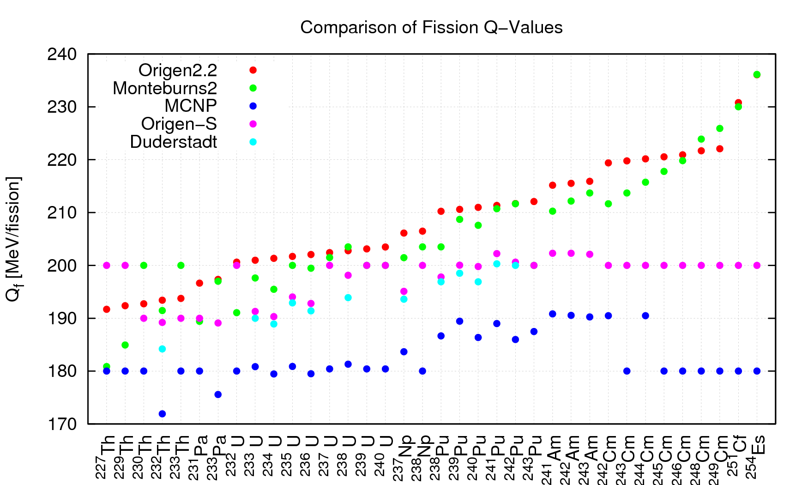

Theory and user's manual for MocDown
====================================

What is MocDown?
----------------

MocDown is a nuclear reactor core simulator.  It performs Monte Carlo depletion, using `MCNP6.1`_ for neutron transport and `ORIGEN2.2`_ for transmutation, just like the  `MOCUP`_, `MONTEBURNS`_, and `VESTA`_ codes.  The :download:`proceedings <../lit/seifried2013aec.pdf>` of the `2013 SNA&MC`_ conference, from which portions of this manual are extracted, may be consulted when this manual is lacking.

Why was it written?
-------------------

MocDown was written in order to simulate depletion for the :download:`RBWR-Th core design <../lit/seifried2013sst.pdf>`.  Existing tools were insufficient because accurate simulation required:

- Continuous-energy three-dimensional Monte Carlo neutron transport
- Tight numerical coupling with thermo-fluids
- An automated search for the equilibrium core composition
- Efficient runtime

However, MocDown was written with flexibility in mind, so a large number of nuclear reactor core designs can be simulated with limited development effort.

.. figure:: ../img/assembly.png
   :height: 200px
   :align: center

   The RBWR-Th multi-assembly unit cell has been simulated with MocDown.

How does it work?
-----------------

MocDown is written in object-oriented `Python3`_.  It employs an accelerated core equilibrium composition search algorithm--ideal for systems with multi-recycling fuel cycles--and allows for loose, online coupling of thermo-fluids models.  Additionally, MocDown takes a simple approach towards neutron source rate scaling, which accounts for isotopic composition-dependent decay heat.

General programming characteristics
^^^^^^^^^^^^^^^^^^^^^^^^^^^^^^^^^^^

MocDown is written in object-oriented `Python3`_.   This allows depletion to be faster, easier, cleaner, and more transparent.

Transmutation is executed in concurrent threads, using standard `Python3`_ libraries.  Typical systems (depleting 50 or so regions) have seen runtime speedups of 6-7x over serial execution.

Transmutation constants (region-wise total flux magnitudes and region-, isotope-, and reaction-wise one-group microscopic cross-sections) are extracted with transport using a single tally which is dynamically generated.  This way, there are no limits to the number of regions or that can be depleted.  The isotopes whose transmutation constants are estimated are determined according to each isotope's contribution to regional molar and mass densities and absorption and fission rates.  This removes the need for a priori specification of the isotopes to be tracked and automatically allows separate sets of isotopes to be tracked in different regions.

Regular expressions are used for robust parsing of transmutation constants from transport output files and of isotopic inventories from transmutation output files.  This allows the usage of MCNP5, MCNPX, or MCNP6 for neutron transport calculations and removes restrictions on the formatting of neutron transport input files.  For large simulations (i.e., with many regions with many isotopes), this style of parsing also tends to be much faster than finite state-based (i.e., FORTRAN style) approaches.

Depletion control parameters (.e.g, power, cycle length, the cells to be depleted, etc.) are defined in a verbose, free-format input file.  This centralization of inputs to a single location eliminates duplication and removes any requirements for special flags or comments within the neutron transport input file.

Objects in memory are periodically serialized, compressed, and written to file in hierarchical format.  This archiving facilitates post-processing and debugging of simulation results through object-native interfaces.  Additionally, these serializations offer a convenient means to reload a depletion state and restart a simulation which may have ended prematurely.

Accelerated equilibrium core composition search
^^^^^^^^^^^^^^^^^^^^^^^^^^^^^^^^^^^^^^^^^^^^^^^

MocDown employs an accelerated core equilibrium core composition search algorithm which is ideal for systems with multi-recycling fuel cycles.  This algorithm reduces runtime for typical simulations from a week down to a day and a half.

The approach MocDown takes is to periodically decouple (i.e., turn off) the neutron transport and thermo-fluids models while transmutation and recycling models iterate.  Upon convergence of isotopic compositions, those models are recoupled (i.e., turned on).  When both cycle multiplication factors and isotopic compositions have converged, the equilibrium core composition search is completed.

.. figure:: ../img/algorithm.png
   :height: 200px
   :align: center

   MocDown employs an accelerated core equilibrium core composition search algorithm.

.. figure:: ../img/isoStacked.png
   :height: 200px
   :align: center

   MocDown efficiently finds the RBWR-Th equilibrium core composition.  Here, dashed lines denote fully-coupled cycles, while the cycles in between are decoupled from neutron transport and thermo-fluids.

Online thermo-fluids coupling
^^^^^^^^^^^^^^^^^^^^^^^^^^^^^

MocDown allows for loose, online coupling of thermo-fluids models.  This allows for accurate self-consistency between reactor physics and thermo-fluids.

User-defined thermo-fluids and fuel processing models are written in external modules.  This segregation between general depletion and system-specific source code simplifies code verification.  Modules can fully contain a model or serve as the interface between MocDown and another program (.e.g, TRACE, COBRA).  MocDown takes care of system density and temperature updates, automatically without any I/O, and carries the most up-to-date solutions along a cycle and across recycles.  Users can provide auxiliary controls like convergence tolerances and relaxation coefficients within the mocdown input file.

.. figure:: ../img/thCoupling.png
   :height: 200px
   :align: center

   MocDown's online thermo-fluids coupling accommodates the strong physical coupling between neutron and thermal fields in the RBWR-Th core.  Here, the `iapws 1.0.0`_ library is used for international-standard IAPWS-IF97 steam tables.

Neutron source rate scaling and decay heat
^^^^^^^^^^^^^^^^^^^^^^^^^^^^^^^^^^^^^^^^^^

MocDown takes a simple approach towards neutron source rate scaling, which accounts for isotopic composition-dependent decay heat.  This avoids a 5-7% bias in flux magnitudes and reaction rates.

Monte Carlo neutron transport codes report quantities like flux magnitude on a per source neutron basis.  In order to convert them to a per second basis, the neutron source rate :math:`S` must be estimated.  MocDown calculates it using:

.. math::
   S = \frac{P_{th} - P_d}{E}

- :math:`P_{th}`, the thermal power at which the core operates, is provided by the user.
- :math:`P_d`, the decay heat, is calculated from isotopic compositions using :math:`P_d = \sum_i N_i \lambda_i Q_i`, where :math:`i` is the index for each isotope, :math:`N` is the number of atoms, :math:`\lambda` is the half-life, and :math:`Q` is the recoverable energy per decay.
- :math:`E`, the total energy deposited in the core per source neutron, is calculated depending upon how MocDown is run.

If coupled neutron/photon transport is performed, both neutron (fission, radiative capture, etc.) and photon (Compton scattering, etc.) heating are considered.  If only neutron transport is performed, the reactions considered depend upon the Q-value library the user selects.  `origen2` considers only fission heating, `origens` considers fission and radiative capture, and others (`mcnp` and `monteburns`) consider only fission, but with different Q-values for each fissile isotope.

When operating in power-mode, ORIGEN2.2 employs its own Q-value correlation, :math:`Q_{Z,A}[MeV] = 1.29927 \times 10^{-3} Z^2 \sqrt{A} + 33.12`, where Z and A are the atomic and mass numbers respectively of a fissile isotope.  In order to match flux magnitudes between ORIGEN2.2 and the transport solution, a special power must be provided to ORIGEN, which uses this correlation and probably doesn't match the transport power.

`MOCUP`_ results can be matched by turning off decay heat and using `mocup` Q-values.  Likewise, `MONTEBURNS`_ results can be matched by turning off decay heat and using `monteburns` Q-values.  However, the most physically accurate simulation turns off decay heat and uses coupled neutron/photon transport.

   Due, partially, to disagreement upon the meaning of "recoverable," recoverable fission energies vary widely among depletion codes.

How do I use it?
----------------

MocDown can be executed from the command-line with the following syntax::

  > ./MocDown.py -h
  usage: MocDown.py [-h] [--version] [--isVerbose] [--isQuiet] [--isRestart]
                    [transportFileName] [mocDownInputFileName]
  
  MOCUP/MONTEBURNS rewritten in Python. Compatible with MCNP5, MCNP6, MCNPX, and
  ORIGEN2.2.
  
  positional arguments:
    transportFileName     MCNP input file (=inp1 by default)
    mocDownInputFileName  MocDown input file (= mocdown.inp by default)
  
  optional arguments:
    -h, --help            show this help message and exit
    --version             show program's version number and exit
    --isVerbose, -v       Verbose operation
    --isQuiet, -q         Hide file operation messages
    --isRestart, -r       Restart depletion from last pickle
  
  Version 1.0 | Jeffrey Seifried 2013

The `examples directory`_ within the MocDown repository provides several example MocDown simulation inputs.  The RBWR-Th simulations demonstrate the implementation of a single-channel thermo-fluids model and a fuel processing scheme.

.. _2013 SNA&MC: https://www.sfen.fr/SNA-and-MC-2013

.. _MCNP6.1: https://mcnp.lanl.gov/
.. _ORIGEN2.2: https://rsicc.ornl.gov/codes/ccc/ccc3/ccc-371.html
.. _MOCUP: https://rsicc.ornl.gov/codes/psr/psr3/psr-365.html
.. _MONTEBURNS: https://rsicc.ornl.gov/codes/psr/psr4/psr-455.html
.. _VESTA: https://rsicc.ornl.gov/codes/ccc/ccc7/ccc-769.html

.. _Python3: https://python.org/

.. _iapws 1.0.0: https://pypi.python.org/pypi/iapws

.. _`examples directory`: https://github.com/jeffseif/MocDown/tree/master/examples
